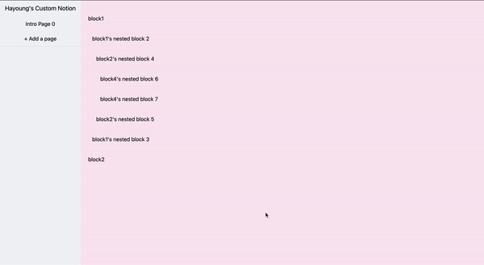

# Custom Notion

- [visit my clone notion site](https://60b1f8dcc4a6b528f0f3ab8e--clone-notion.netlify.app/pageID_0)
  - you can add new block by "Enter" on the last element of the current sub-blocks.
  - you can tab until you reach 4 depth.



## blogging

- [React 관련 싹훑기(7) - Redux 앱 구상 및 간단한 상태설계](https://mytutorials.tistory.com/403)
- [React 관련 싹훑기(8) - 간단하게 Notion처럼 Editing이 가능한 블럭 구성하기](https://mytutorials.tistory.com/407)
- [React 관련 싹훑기(9) - 중첩되게 block이 들어갈 수 있도록 구성하기 + Tab기능(아직은 two depth) + focusing](https://mytutorials.tistory.com/408)
- [React 관련 싹훑기(10) - Enter, Tab, 블럭 에디팅 기능까지 리팩토링 완료!](https://mytutorials.tistory.com/411)

## how to run

```javascript
yarn install
yarn start
```

## ref

- https://medium.com/swlh/how-to-build-a-text-editor-like-notion-c510aedfdfcc
- https://github.com/konstantinmuenster/notion-clone
